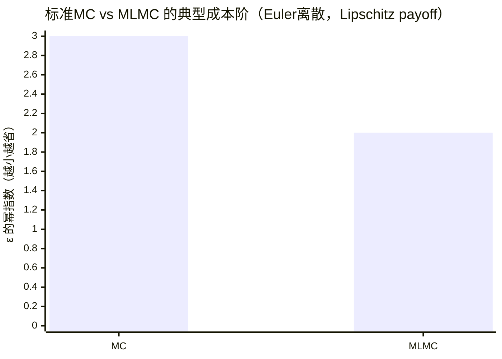

# 退化噪声随机系统的理论与数值研究进展综述

## 执行摘要

带**退化噪声**（degenerate noise）的随机系统，典型地指随机扰动只作用在状态空间的部分方向，或噪声强度随状态变化并可能在某些区域/流形上**降秩甚至消失**。此类系统的“生成元”对应**非一致椭圆**的二阶算子，因而许多经典工具（如一致椭圆 PDE 的 Schauder/Aronson 理论）需要被替换或加强。其核心图景是：**扩散只在少数方向发生，但漂移与噪声方向通过李括号/耦合把随机性传播到全空间**，从而出现次椭圆（hypoelliptic）平滑、遍历与混合等现象。

理论方面，现代主线通常由三条链路构成：  
(1) **Hörmander 括号条件 →（次椭圆）平滑性/密度存在**：从  的次椭圆判别（1967）出发，（1978）引入随机变分（Malliavin calculus）给出概率证明与密度正则性框架，随后有简化与统一化（如 Norris、Kusuoka–Stroock、Hairer 等）。  
(2) **平滑/强 Feller + 可达性/不可约性 → 遍历性与混合速率**：在退化噪声情形，“小集/次小化”往往来自次椭圆平滑与控制可达性，配合 Harris 定理即可推出唯一不变测度与指数混合；在典型的动力学（如 kinetic Fokker–Planck/Langevin）中，**hypocoercivity** 给出更“结构化”的指数收敛与可计算速率。  
(3) **小噪声/短时极限 → 大偏差与几何**：退化噪声下的大偏差率泛函通常等价于“控制能量”最小化；强退化且代数结构（零幂化/分级）显著时会出现**分级（graded）LDP**与次黎曼几何控制距离。

数值方面，退化噪声并不必然降低经典离散格式（Euler–Maruyama 等）的**有限时间强/弱收敛阶**，因为这些阶数多依赖于系数 Lipschitz 与矩条件，而不要求扩散矩阵可逆；但退化会显著影响：  
- **弱误差分析所需的 Kolmogorov PDE 正则性**（此处次椭圆性反而是利好）；  
- **长时间采样/不变测度偏差**（需要结合 hypocoercivity 与 backward error analysis）；  
- **结构保持（如正性、约束流形、守恒律）**与稀有事件方差控制（MLMC/重要性采样）。

下面给出按“定义—适定性—正则性—长期动力学—大偏差—控制—数值方法”的系统化梳理，并在每部分给出关键定理假设、证明思路要点、代表性文献与可操作的数值建议。

```mermaid
flowchart LR
A[退化结构: 降秩/消失/部分受噪] --> B[分析工具]
B --> B1[Hörmander/李括号]
B --> B2[Malliavin 协方差]
B --> B3[Harris+Lyapunov 小集]
B --> B4[Hypocoercivity]
B --> C[结论层]
C --> C1[密度平滑/强Feller]
C --> C2[遍历/混合速率]
C --> C3[LDP/稀有事件几何]
C --> D[数值层]
D --> D1[离散收敛(强/弱)]
D --> D2[不变测度偏差]
D --> D3[MLMC/方差缩减]
D --> D4[粒子/谱/多尺度]
D --> E[应用: 动力学Langevin/过滤/金融/控制]
```

## 退化噪声：定义、分类与建模范式

考虑一般（不预设具体形式的）Itô 随机系统
$$
\mathrm dX_t=b(X_t)\,\mathrm dt+\sigma(X_t)\,\mathrm dW_t,\qquad X_t\in\mathbb R^d,\; W_t\in\mathbb R^m,
$$
其扩散矩阵 $a(x)=\sigma(x)\sigma(x)^\top$ 是 $d\times d$ 半正定矩阵。所谓“非退化/一致椭圆”通常要求存在 $\lambda>0$ 使 $a(x)\ge \lambda I$（各向同性、全方向扩散）；而**退化噪声**意味着 $a(x)$ 在某些点/方向上不再正定（秩小于 $d$ 或最小特征值可趋于 0），使生成元成为（仅）半椭圆或次椭圆算子。

在研究与应用中，退化大致可按“几何结构 + 噪声如何传播”分为四类（与你问题中点名的四种基本对齐）：

1) **部分退化（partially degenerate，常秩但 $m<d$**）：噪声只直接作用于部分分量，但漂移把噪声传播到其它分量。典型原型是**动量—位置耦合**的 kinetic Langevin/随机哈密顿系统，噪声注入动量（速度）而位置仅通过 $\dot q=p$ 获得随机性。  

2) **次椭圆/“Hörmander 型”退化（hypoelliptic degeneracy）**：虽然 $a(x)$ 退化，但由漂移与噪声向量场的李括号生成的分布在每点张成全空间，从而获得平滑密度等强正则结论（Hörmander 条件）。  

3) **乘性退化（multiplicative degeneracy：$\sigma(x)$ 随状态变化并可能在边界/零点消失）**：如平方根型扩散（CIR/Heston 族）在 $x=0$ 处扩散强度为 0，从而引入边界可达性、正性保持与数值格式设计问题；这类系统虽可在一维/特殊结构下解析，但一般会出现非光滑系数与边界层效应。  

4) **状态依赖降秩（state-dependent rank degeneracy）**：$\mathrm{rank}\,\sigma(x)$ 随 $x$ 改变，甚至在某些集合上突然降秩；此时 Hörmander 条件可能只在局部成立或以“弱 Hörmander”形式成立，密度的支撑与正性会出现强几何依赖。  

为便于后续“何种理论可用”，下表给出（粗粒度但实用的）对应关系。

| 退化类型 | 典型结构特征 | 主要可用理论工具 | 常见可得结论（在附加条件下） | 主要难点/风险点 |
|---|---|---|---|---|
| 部分退化（常秩，噪声在子空间） | $m<d$，噪声注入子空间；漂移耦合 | Hörmander、Malliavin、Harris、hypocoercivity | 平滑密度、唯一不变测度、指数混合；可证明离散链遍历性 | 噪声传播依赖耦合；长时间数值偏差更敏感  |
| 次椭圆（括号生成） | 李括号生成全维 | Hörmander(1967)、Malliavin(1978)、Norris 引理 | 转移密度 $C^\infty$、强 Feller、密度正性区间 | 需要验证括号条件；弱 Hörmander 情形更精细  |
| 乘性退化（噪声可消失） | $\sigma(x)=0$ 于边界/集合 | 一维边界分类、路径唯一性、正性保持格式 | 正性/不可穿越边界；不变测度存在（视漂移） | 数值易“穿越”边界；弱误差/密度可能奇异  |
| 状态依赖降秩 / 弱 Hörmander | 秩随 $x$ 变；传播结构局部化 | 局部 Malliavin、parametrix、管状估计 | 局部密度估计、支撑/正性判别、短时渐近 | 全局遍历可能失败；多不变测度/亚指数混合  |

**数值实现建议（建模阶段就要做）**：在开始任何数值模拟之前，建议先明确你研究对象属于哪类退化：  
- 若是“部分退化 + 耦合传播”，优先尝试验证（或构造）Hörmander/可控性条件，因为它同时决定密度正则性与遍历（进而决定采样算法可行性）。  
- 若是“噪声可消失”，先做边界可达性与正性分析（是否会撞到退化集合、撞到后如何演化），否则数值上需要强制正性/反射/吸收的结构保持。  
- 若是“状态依赖降秩”，要区分局部与全局可达性：局部有密度并不自动推出全局唯一遍历。  

## 适定性：存在唯一性、弱/强解与不可约性

退化噪声下，最基础的问题仍是：解是否存在（weak/strong），是否唯一（law uniqueness / pathwise uniqueness），是否爆炸，以及解流的正则性如何。许多“第一层”结论**不要求**扩散矩阵可逆：只要系数满足局部 Lipschitz 与线性增长，就可得到强解存在唯一（经典 Itô 理论）。这一点在标准教材体系中是明确的。  

**关键定理（经典强适定性，非退化非必要）**：若 $b,\sigma$ 在 $\mathbb R^d$ 上局部 Lipschitz 且满足线性增长，则对任意初值 $X_0=x$ 存在唯一（不会爆炸的）强解；并且解对初值在局部意义下连续。主要证明基于 Picard 迭代、Burkholder–Davis–Gundy 不等式与 Grönwall。  

当系数不满足 Lipschitz（尤其是乘性退化、粗糙漂移、Sobolev 系数）时，退化会显著改变“噪声正则化”能力：在一致椭圆情形可用的 Zvonkin 变换/偏微分方程正则化，到了退化情形往往需要额外结构（例如 Hörmander 传播或特殊链式结构）才能成立。相关方向在近十余年有一批针对“退化 + 低正则系数”的强唯一性成果：

-  与  证明了对**可能退化**的多维 SDE，在扩散系数处于 Sobolev/Holder 类、漂移较粗糙的条件下仍可得强唯一性与弱存在；核心工具包括 Krylov 型估计、正则化与局部化。  
-  对退化系统在 Hölder 漂移（指数超过临界阈值）情形给出路径唯一性证明，反映了退化噪声下的临界正则门槛现象。  
-  等对带奇异速度场的阻尼 Langevin（典型部分退化）建立强适定性并进一步讨论指数遍历（见下一节）。  

**证明思路要点（为何这些方法能“顶住退化”）**：  
(1) 通过“把 SDE 变成 PDE 的估计问题”仍然是主线，但 PDE 不再是一致椭圆方程，而是 Kolmogorov 型退化 PDE；因此往往需要利用系统的链式结构或 Hörmander 传播来获取足够的先验估计（例如某些方向上的次椭圆 Schauder/L^p 正则）。  
(2) Krylov 估计与 Girsanov 变换仍可用，但可用范围更受限制，因为退化会导致噪声方向不足以“抹平”漂移的不规则性。  

**不可约性/可达性（为遍历打基础）**：适定性之外，退化系统常需要额外验证“从任意点能进入足够大的集合”这一性质。经典做法是将其转化为控制系统可达性（支撑定理），或借助密度正性判别。  

**数值实现建议**：  
- 在粗糙系数或强非线性场景，优先使用“tamed/implicit”思想或能量控制型离散（见后文），并在模拟中实时监控矩增长/爆炸迹象（例如动量平方、Lyapunov 函数。）。对应的理论动机来自这些强适定性工作普遍依赖的 Lyapunov 与 Krylov 估计框架。  
- 若目的是长时间统计（不变测度/遍历平均），适定性证明里出现的 Lyapunov 函数往往可直接复用为数值稳定性诊断量。  

## 正则性：Hörmander 型次椭圆、Malliavin 工具与密度估计

退化噪声的“最核心增益”往往不是强解存在性本身，而是**在退化条件下仍能得到平滑的转移密度与强 Feller 性**，使得长期动力学与控制问题可处理。这里的中心结果就是 Hörmander 次椭圆理论及其 Malliavin 概率证明。

**关键定理（Hörmander 1967：括号条件 ⇒ 次椭圆/平滑）**：对二阶算子
$$
L = V_0 + \frac12\sum_{i=1}^m V_i^2
$$
（$V_i$ 是光滑向量场），若在每个点 $x$ 上，由 $\{V_1,\dots,V_m\}$ 与其与 $V_0$ 的迭代李括号生成的李代数张成 $\mathbb R^d$，则对应的偏微分算子是**hypoelliptic**，因此转移概率具有 $C^\infty$ 密度（在适当条件下）。  

**Malliavin calculus 路线（Malliavin 1978 及其发展）**：Malliavin 的突破是引入 Wiener 空间上的微分结构，定义并分析**Malliavin 协方差矩阵**
$$
\mathcal M_t = \langle DX_t, DX_t\rangle_{L^2([0,t])},
$$
证明其在 Hörmander 条件下几乎处处可逆且逆矩具有足够矩，从而推出密度存在与平滑。随后  的专著系统化了该理论； 提供了广为使用的简化工具（含 Norris 引理）， 与  给出密度估计、近似与误差分析的经典框架； 的讲义/论文提供了现代化的短证明与直观解释。  

**证明思路要点（为什么括号条件能“补齐”退化方向）**：  
- 从动力系统角度，$V_i$ 给出直接噪声方向，“漂移 + 噪声方向”通过李括号刻画的高阶效应在小时间尺度内产生额外可达方向（类似控制系统的 Lie algebra rank condition）。这与控制可达性理论深度同构（见后文“控制与支撑定理”）。  
- Malliavin 路线把这一几何传播转化为协方差矩阵的下界估计：若某方向 $\xi$ 使 $\langle \mathcal M_t\xi,\xi\rangle=0$，意味着沿噪声路径的任何微扰都无法在该方向产生变化；Hörmander 条件排除了这种情况，通过 Norris 引理与迭代括号展开可得 $\det \mathcal M_t>0$ 的概率下界。  

**密度估计与“噪声传播链”**：在部分退化系统中，人们常关注密度的定量上/下界与短时标度。 与  针对“第一分量受非退化噪声驱动，其余分量为确定性链式传递”的模型给出双边密度估计与几乎最优的标度行为，这是“退化但可传播”的原型结果之一。  
与此相关的还有弱 Hörmander 条件下的管状估计（tube estimates），揭示“可达性几何”如何进入密度估计。  

**数值实现建议（正则性层面对算法的影响）**：  
- 若你要证明或利用弱误差阶、或要用 PDE/半群方法分析算法偏差，**确认系统满足 Hörmander（或其弱形式）是关键分水岭**：满足时，Kolmogorov 方程解的平滑性更可期，从而 Talay–Tubaro 式弱误差展开更容易成立；若不满足，则弱误差可能被非光滑密度、边界奇性或支撑维数降低所主导，需要改写误差分析（例如改用路径空间方法或局部化）。  
- 对实际计算，验证 Hörmander 的“工程化”做法通常是：在感兴趣区域采样若干点，数值计算向量场及其低阶李括号的张成维数（符号/自动微分都可），用于初步判断噪声传播是否充分；这也同时为后续控制可达性分析服务。  

## 长期动力学：不变测度、遍历、混合与稳定分岔

退化噪声系统的长期行为是最丰富也最“应用导向”的部分：你关心的不仅是是否存在不变测度，还关心唯一性、混合速率（mixing rate）、以及噪声对稳定性/分岔的影响。这里常用两类互补框架：**Harris–Lyapunov（概率）**与 **hypocoercivity（算子/能量）**。

**Harris 型遍历性（强通用框架）**：  
在一般马尔可夫过程层面，Harris 定理指出：若存在 Lyapunov 函数 $V$ 使得
$$
P_t V \le \alpha V + \beta\quad (\alpha<1),
$$
并且某个“$V$ 的小水平集”是小集（minorization/small set），则过程具有唯一不变测度，且在加权全变差度量下指数收敛。 与合作者给出了适用于 SDE（含退化噪声）及其时间离散的系统性做法：用 Markov 链理论（Meyn–Tweedie 思路）证明几何遍历，并分析离散近似的稳健性。  
同时，Hairer 等对 Harris 证明给出更“可操作”的版本，常被用作 SPDE/退化扩散的遍历工具箱。  

在退化噪声情形，“小集”往往来自两条路径：  
- **次椭圆平滑 ⇒ 强 Feller ⇒ 局部密度下界 ⇒ 小集**；  
- **支撑定理/可控性 ⇒ 可达性 ⇒ 不可约性**，再配合局部平滑得到小集。  

**Hypocoercivity（结构化指数趋于平衡）**：  
在 kinetic Fokker–Planck、Langevin 等典型退化扩散中，生成元常可分解为 “耗散项 + 反对称输运项”，直接耗散缺失导致标准 Poincaré/谱隙工具不直接适用，此时 hypocoercivity 通过构造等价范数/熵泛函，把输运耦合带来的间接耗散显式化，从而得到指数趋于平衡与可计算速率。 的系统性综述（Hypocoercivity）奠定了该方法的统一框架；、、 等给出针对线性动理学方程的精细化版本。  
在随机哈密顿/阻尼 Langevin 场景， 讨论了指数收敛到不变测度与隐式离散的长期性质，这是“退化扩散 + 长期数值近似”连接理论与算法的经典文献。  

**稳定性与分岔（退化噪声的特殊性）**：  
- 在随机稳定性理论中，Lyapunov 函数与指数稳定/有界性等概念形成基本工具； 的专著系统整理了随机微分方程稳定性（包含受控系统的稳定化思想）。  
- 从随机动力系统（RDS）角度， 的专著将随机系统视作“随机映射/随机流”，用随机吸引子、Lyapunov 指数等刻画噪声引发的稳定/同步/分岔。  
- 退化噪声对分岔的影响高度依赖“噪声是否能到达不稳定模态”。例如在“只激发部分模态”的加性退化噪声下，可能出现稳定化阈值、稳态测度的分岔与 Lyapunov 指数符号变化；近期工作在特定模型（如 Kolmogorov 型系统）中给出系统讨论。  

**数值实现建议（长期统计）**：  
- 若研究目标是混合速率或稳态采样，建议优先构造可验证的 Lyapunov 函数并数值检查漂移条件，因为这直接决定你能否用 Harris 或 hypocoercivity 控制误差与运行时间。  
- 对 kinetic/Langevin 类系统，长时间采样往往更看重“对不变测度的偏差阶”而非有限时间强误差；此时 splitting（如 BAOAB）与 backward error analysis 往往比单纯提高强阶更有效（见数值节）。  

## 罕见事件：大偏差与样本路径理论

在退化噪声下，大偏差（LDP）既是理论工具（刻画稳态跃迁、亚稳态、短时热核几何），也是数值设计的指南（重要性采样、最可能路径）。退化的关键影响在于：**率泛函只对噪声可达方向有限**，并且在强退化/次黎曼几何情形，短时标度可能不是“统一缩放”的。

**Freidlin–Wentzell 型小噪声 LDP（控制表述，退化可纳入）**：  
经典观点：对小噪声系统
$$
\mathrm dX_t^\varepsilon=b(X_t^\varepsilon)\,\mathrm dt+\sqrt{\varepsilon}\,\sigma(X_t^\varepsilon)\,\mathrm dW_t,
$$
样本路径在 $\varepsilon\to0$ 下满足 LDP，率泛函可写为受控确定性方程
$$
\dot x = b(x)+\sigma(x)u
$$
的控制能量最小化 $\frac12\int_0^T\|u(t)\|^2\,\mathrm dt$（不可达方向代价为 $\infty$）。这一“变分/控制”形式在弱收敛方法框架下尤其清晰，并可在**可能退化**的 Itô 过程上成立。  

其中， 与  明确讨论了“可能退化”的小噪声 Itô 过程，在较温和假设下用 Dupuis–Ellis 弱收敛策略给出 LDP，并给出对平方根扩散等例子的应用。  
 与  的专著则系统呈现了变分表示、弱收敛与稀有事件数值近似之间的统一框架。  

**次椭圆/强退化的短时大偏差与几何**：  
在 Hörmander 系统中，短时热核渐近与大偏差常与次黎曼距离相关。 与  的工作给出热核在对角线附近的指数衰减与几何结构联系，是经典基石。  
对于“强退化且李代数具零幂结构”的情形，Ben Arous 与  提出了分级大偏差原理（graded LDP），反映不同方向的有效时间标度不同。  

**数值实现建议（稀有事件）**：  
- 若你要计算跃迁概率/最可能路径，优先写出控制问题的 Euler–Lagrange/Hamilton 方程，或用变分方法求最小作用量路径；退化噪声下要特别注意“可达集”的几何约束——很多路径的代价实际上是 $\infty$。这一点从支撑定理与控制表述可直接看出。  
- 重要性采样与自适应偏置往往可从最优控制（零方差偏置）出发构造；Budhiraja–Dupuis 体系强调这类“表示 + 数值”闭环。  

## 控制与可达性：可控性、支撑定理与稳定化

退化噪声系统与几何控制之间有直接对应：噪声只在 $m$ 个方向驱动，等价于控制系统只允许沿这 $m$ 个向量场施加控制输入。因此“系统能到哪儿”“密度在哪里为正”“是否不可约”等问题，都可以以控制可达集/轨道理论来刻画。

**支撑定理（Stroock–Varadhan 1972）**：  
在适当正则条件下，扩散过程在路径空间 $C([0,T];\mathbb R^d)$ 上的法则支撑（support）等于“以 Cameron–Martin 路径作为控制”的受控常微分方程解集的闭包。直观上，这说明：**退化噪声不会自动‘填满’全空间；它能到达的区域由相应控制系统决定**。  

控制理论进一步给出“何时可达集是满维”的判据：  
- **轨道定理/李括号结构**： 的轨道定理刻画由向量场族生成的轨道为浸入子流形，并与括号闭包相关；在典型条件下，李代数秩条件可推出局部可控性与可达集的维数结论。  
- 几何控制的系统性教材（如  与 ）总结了 Chow–Rashevskii、Lie algebra rank condition 等与可控性相关的几何机制，这也正是 Hörmander 条件在控制侧的“同源版本”。  

**密度正性与可达性**：密度是否在某点严格为正，本质上与能否用控制系统从初值到达该点有关。近年的工作把 Ben Arous–Léandre 的思想与控制几何结合，给出可操作的正性判据。  

**稳定化与控制**：退化噪声下，噪声并不一定稳定系统；但如果噪声方向经耦合能够影响不稳定模态，则可能产生噪声诱导稳定、同步等现象。稳定化的一般理论仍以 Lyapunov 方法为核心（可扩展到受控扩散）。  

**数值实现建议（控制/可达性相关计算）**：  
- 实务上，支撑定理提示一种“先验诊断”：用确定性受控系统（把 $dW_t$ 换成分段线性控制）做可达性数值实验，可快速判断状态空间的可达区域、潜在不变流形以及多稳态结构。  
- 若你要做过滤/观测同化，退化噪声往往意味着“隐状态在部分方向上缺乏直接激励”，粒子滤波可能出现退化（权重塌缩）更严重，应更早引入重采样、局部 MCMC move 或基于控制的 proposal（见后文粒子法）。  

## 数值方法：离散化、收敛率、方差缩减与多尺度

这一节将数值方法分为三层目标：  
- **有限时间轨道近似**（强/弱收敛）；  
- **长时间统计/不变测度采样**（偏差与混合）；  
- **不确定性量化/稀有事件**（方差缩减与多尺度）。

### 离散化与强/弱收敛：退化是否改变收敛阶？

**基础结论（Euler–Maruyama 等的强/弱阶）**：在全局 Lipschitz 与线性增长等标准条件下，Euler–Maruyama 的强收敛阶典型为 $1/2$，弱收敛阶典型为 $1$；这些结论本身不依赖扩散矩阵可逆。 的综述讲义是数值模拟 SDE 的高可读入口；弱误差系统展开的基础来自  与 Talay 的经典工作（Talay–Tubaro 展开）。  

**退化带来的“弱分析差异”**：  
强收敛更多直接依赖路径估计（BDG + Grönwall），因此在光滑系数下通常不因退化而本质改变；但弱误差分析常通过 Kolmogorov backward PDE 的解的高阶导数有界性来实现。退化系统若满足 Hörmander 次椭圆，则反而可保证足够平滑；若不满足，弱误差可能被非光滑性主导，从而需要换工具。  

**隐式/稳定化离散**：对刚性或强耗散系统，隐式 Euler 常用于提升稳定性，且在某些退化系统（如随机哈密顿/阻尼 Langevin）中能与长期遍历分析良好耦合（Talay 2002）。  

**乘性退化（正性保持）专门格式**：平方根扩散（例如 CIR）要求数值上保持非负性，否则会产生不可解释的复数噪声项或严重偏差。 系统研究了 CIR 的离散与高阶弱格式，并给出在无参数限制条件下的可实现方案，是“噪声在边界退化”的代表性数值文献。  

### 长时间采样：splitting、backward error 与不变测度偏差

对遍历系统，更常见的任务是估计稳态平均 $\int \varphi\,\mathrm d\mu$ 或生成近似独立样本。此时，“单步强误差”并不等价于“稳态偏差”，需要专门的长期分析。

**Talay 2002（随机哈密顿系统）**：研究了随机哈密顿系统的指数趋于不变测度，并讨论隐式 Euler 离散对长期统计的影响，是连接“退化动力学 + 不变测度 + 数值近似”的经典桥梁。  

**分裂法与 BAOAB（Langevin/动理学系统）**：在分离可解子算子（如漂移、摩擦、噪声）后进行 splitting，可得到对 Gibbs 测度采样表现优异的算法。 与  通过 BCH 展开比较多种 Langevin 积分器，并揭示 BAOAB 等方法在某些极限下的“超收敛/低偏差”性质，这在分部退化的采样问题中具有很强实践意义。  

**高阶不变测度近似**： 等研究了如何构造对不变测度具有更高阶精度的数值方法（通过修正漂移/噪声或高阶后向误差分析），适用于遍历扩散的稳态平均评估。  

### 方差缩减与蒙特卡洛：MLMC、小噪声与稀有事件数值

**MLMC（多层蒙特卡洛）**： 的 MLMC 结果表明，在典型 Lipschitz payoff + Euler 离散下，把均方误差控制到 $O(\varepsilon^2)$ 的计算复杂度可从标准 MC 的 $O(\varepsilon^{-3})$ 降到 $O(\varepsilon^{-2}(\log \varepsilon)^2)$（更理想的设置下可达 $O(\varepsilon^{-2})$）。这是实践中最通用的方差缩减机制之一。  



**小噪声与退化结构下的改进**：在小噪声极限中，粗粒度离散的方差结构会变化，MLMC 需要与小噪声结构匹配的耦合策略；、Higham 与  专门分析了小噪声 SDE 的 MLMC 行为。  

**稀有事件加速**：与大偏差部分对应，基于变分表示/最优控制的加速蒙特卡洛在 Budhiraja–Dupuis 体系中被系统讨论；理论上最优偏置与率泛函最小化紧密相关。  

### 多尺度方法：平均/齐次化 + 退化噪声

退化噪声系统中多尺度现象很常见：快变量可能正是受噪声驱动的分量，而慢变量缺少直接噪声。此时如果直接全系统细步长模拟会极其昂贵。

**HMM（异质多尺度方法）**： 与  的综述提出 HMM 的通用设计原则，并明确把随机/多尺度模拟作为重要应用场景。该框架尤其适合“噪声在快变量、慢变量退化”的结构：用微观模拟估计宏观闭合项，宏观步进保持大步长。  

### 粒子方法：过滤、相互作用粒子与退化问题

退化噪声常出现在过滤/同化中：系统噪声维数较低、观测不完整，使得后验分布呈现强几何结构。

- 顺序蒙特卡洛（SMC）方法的系统性总结可参见 、、 的专著，它涵盖收敛基础与工程技巧（重采样、提议分布设计等）。  
- 相互作用粒子与 Feynman–Kac 表述方面， 的专著提供了严格概率框架，并讨论潜在函数退化等粒子退化问题。  

**数值建议**：退化噪声 + 高维会显著放大粒子退化：建议尽早使用（i）局部 MCMC rejuvenation，（ii）基于控制/线性化的 proposal，（iii）使用 MLMC/多分辨率同化减成本。  

### 谱方法与确定性 PDE 方法：Fokker–Planck/Kolmogorov 的数值

当维数较低（或结构可分离）时，直接求解概率密度 PDE 往往比路径模拟更高效，并能自然处理退化耗散结构（如动理学 FP）：

- 对动理学/非自伴算子谱理论与次椭圆估计，Helffer–Nier 的专著是重要参考（从理论到算子谱结构）。  
- 在碰撞算子/FP–Landau 等场景， 等给出快速谱方法与守恒结构讨论，体现谱方法在 FP 类方程的高精度潜力。  
- 更近期的工作在一般 FP 方程与复杂边界条件下构造稳定谱格式，显示“谱方法 + 结构保持”的持续发展。  

---

### 数值方法对比表：收敛、优缺点与退化特性适配

| 方法族 | 典型适用目标 | 典型收敛结论（在标准假设下） | 退化噪声下常见优点 | 退化噪声下常见风险/注意点 | 代表性文献 |
|---|---|---|---|---|---|
| Euler–Maruyama（显式） | 有限时间路径近似；MC | 强阶 1/2；弱阶 1（Lipschitz/足够光滑时） | 实现最简单；不要求扩散可逆 | 刚性/长时间偏差较大；边界退化会穿越（如负值） | Higham(2001)；Talay–Tubaro(1990)  |
| 隐式 Euler / 半隐式 | 刚性与长期稳定 | 稳定性更好；可与遍历分析结合 | 更易满足 Lyapunov 漂移条件，利于长期模拟 | 需解非线性方程；高维成本 | Talay(2002)  |
| Tamed/截断类 | 非全局 Lipschitz 漂移 | 在多项式增长漂移下可恢复收敛 | 抑制爆炸，适合强非线性 | 可能引入偏差；需调参 |（遍历近似方向的现代工作可参照 Mattingly 体系与后续文献） |
| Splitting（BAOAB 等） | Langevin/动理学采样 | 注重不变测度偏差与采样效率 | 对部分退化采样特别有效；可出现“超收敛” | 需与模型结构匹配；非对称 splitting 可能增偏差 | Leimkuhler–Matthews(2013)  |
| 正性保持格式（平方根扩散等） | 乘性退化且需非负 | 专门弱高阶方案可构造 | 结构保持（非负）是硬约束 | 格式复杂；误差分析依赖边界行为 | Alfonsi(2005/2010)  |
| MLMC | 期望/分布量的高效估计 | 成本从 ε^{-3} 降至 ε^{-2}(log ε)^2 等 | 与退化噪声无冲突，适合作大规模 UQ | 关键在耦合设计；弱正则性会影响方差衰减 | Giles(2008)；Anderson–Higham–Sun(2016)  |
| HMM/多尺度 | 快慢变量、平均/齐次化 | 宏观误差由闭合估计决定 | 特别适合“噪声只在快变量”的退化结构 | 需要可重复的微观采样；误差分解复杂 | E–Engquist(2003)  |
| 粒子法（SMC/Feynman–Kac） | 过滤/后验推断 | 一致性与收敛（理论成熟） | 可处理非线性/非高斯 | 退化噪声更易权重塌缩；需 rejuvenation | Doucet–de Freitas–Gordon(2001)；Del Moral(2004)  |
| 谱/确定性 PDE 法 | 低维密度演化、稳态 | 高精度、可做谱隙/模态分析 | 能直接体现 hypocoercivity 结构 | 维数灾难；边界与非自伴稳定性难 | Helffer–Nier(2005)；Pareschi 等  |

---

### 开放问题与实际挑战（面向研究工作的“问题清单”）

1) **弱 Hörmander/状态依赖降秩下的“可计算判据”**：理论上存在管状估计与正性判别，但在高维与复杂漂移场景，如何形成鲁棒的数值检验与可用于算法设计的下界仍不成熟。  

2) **退化噪声下的长期数值误差理论**：对许多 splitting 与 tamed 方法，有限时间强误差并不能解释采样偏差；需要与 hypocoercivity/Harris 理论更紧密结合的“可证明、可量化”的偏差—成本权衡。  

3) **稀有事件数值的系统化**：虽然变分表示与 LDP 在退化情形已较成熟（控制表述），但把这些理论稳定地转化为高维有效算法（自适应重要性采样、神经控制等）仍存在普遍困难，尤其当可达集具有复杂几何（多连通、流形约束）时。  

4) **含跳噪声/非高斯退化**：链式传播的 Lévy 噪声退化已出现新工作，但对一般非高斯驱动的“次椭圆 + 遍历 + 数值”统一理论仍在发展中。  

---

**实践性建议（把理论落到可复现计算）**：  
- 若你的目标是“证明/利用平滑密度、强 Feller、不可约性”，优先围绕“李括号张成性 + Malliavin 协方差可逆 + 支撑定理可达性”三件套组织证明与数值验证。  
- 若目标是“稳态采样”，优先选择在目标系统上有明确长期偏差分析的 splitting（尤其是动理学/ Langevin 系统），并配合 Harris/hypocoercivity 视角设置摩擦/步长与 burn-in。  
- 若目标是“大规模期望计算”，默认使用 MLMC（除非模型非常低维可用 PDE 法），并把“耦合误差 + 退化导致的方差结构”作为核心诊断指标。  
- 若涉及“边界退化/正性”，不要用原始 EM；直接选正性保持或变换后离散，并把边界击中概率作为单元测试。  

---

**参考文献（代表性，按主题覆盖；括号为文中引用格式）**

- Hörmander, L. (1967). *Hypoelliptic second order differential equations*. Acta Mathematica.   
- Malliavin, P. (1978). *Stochastic calculus of variations and hypoelliptic operators*. Proc. Int. Symp. SDE (Kyoto 1976).   
- Nualart, D. (2006). *The Malliavin Calculus and Related Topics* (2nd ed.). Springer.   
- Norris, J. R. (1986). *Simplified Malliavin calculus*. Séminaire de Probabilités XX.   
- Kusuoka, S., & Stroock, D. W. (1985). *Applications of the Malliavin calculus, Part II*. J. Fac. Sci. Univ. Tokyo Sect. IA Math.   
- Hairer, M. (2011). *On Malliavin’s proof of Hörmander’s theorem*. Bull. Sci. Math.   
- Delarue, F., & Menozzi, S. (2010). *Density estimates for a random noise propagating through a chain of differential equations*. J. Functional Analysis.   
- Pigato, P. (2018). *Tube estimates for diffusion processes under a weak Hörmander condition*. AIHP (Probab. Stat.).   
- Stroock, D. W., & Varadhan, S. R. S. (1972). *On the support of diffusion processes with applications to the strong maximum principle*. Proc. Sixth Berkeley Symp.   
- Sussmann, H. J. (1973). *Orbits of families of vector fields and integrability of distributions*. Trans. AMS.   
- Agrachev, A. A., & Sachkov, Y. L. (2004). *Control Theory from the Geometric Viewpoint*. Springer.   
- Mattingly, J. C., Stuart, A. M., & Higham, D. J. (2002). *Ergodicity for SDEs and approximations: locally Lipschitz vector fields and degenerate noise*. Stochastic Processes and their Applications.   
- Hairer, M., & Mattingly, J. C. (2008/2011). *Yet another look at Harris’ ergodic theorem for Markov chains*. (Seminar proceedings; arXiv version 2008).   
- Kupiainen, A. (2008). *Ergodic theory of SDE’s with degenerate noise* (survey/review chapter).   
- Villani, C. (2009). *Hypocoercivity*. Memoirs of the AMS.   
- Dolbeault, J., Mouhot, C., & Schmeiser, C. (2015). *Hypocoercivity for linear kinetic equations conserving mass*. Trans. AMS.   
- Talay, D. (2002). *Stochastic Hamiltonian systems: exponential convergence to the invariant measure, and discretization by the implicit Euler scheme*. Markov Processes and Related Fields.   
- Wang, Z., & Zhang, X. (2018). *Strong uniqueness of degenerate SDEs with Hölder diffusion coefficients*. arXiv.   
- Wang, Z., & Zhang, X. (2020). *Existence and uniqueness of degenerate SDEs with Sobolev diffusion coefficients and rough drifts*. J. Mathematical Analysis and Applications.   
- Chaudru de Raynal, P.-E. (2017). *Strong existence and uniqueness for degenerate SDE with Hölder drift*. AIHP (Probab. Stat.).   
- Song, R. (2019/2020). *Damped Langevin SDEs with singular velocity fields: strong well-posedness and exponential ergodicity*. Stochastic Processes and their Applications.   
- Khasminskii, R. (2012). *Stochastic Stability of Differential Equations* (2nd ed.). Springer.   
- Arnold, L. (1998). *Random Dynamical Systems*. Springer.   
- Ben Arous, G., & Léandre, R. (1991). *Décroissance exponentielle du noyau de la chaleur sur la diagonale (I)*. Probability Theory and Related Fields.   
- Ben Arous, G., & Wang, J. (2019). *Very rare events for diffusion processes in short time*. arXiv.   
- Budhiraja, A., & Dupuis, P. (2019). *Analysis and Approximation of Rare Events: Representations and Weak Convergence Methods*. Springer.   
- Chiarini, A., & Fischer, M. (2013/2014). *On large deviations for small noise Itô processes*. (Preprint; AAP version).   
- Higham, D. J. (2001). *An Algorithmic Introduction to Numerical Simulation of Stochastic Differential Equations*. SIAM Review.   
- Talay, D., & Tubaro, L. (1990). *Expansion of the global error for numerical schemes solving stochastic differential equations*. Stochastic Analysis and Applications / related proceedings (INRIA preprint).   
- Leimkuhler, B., & Matthews, C. (2013). *Rational construction of stochastic numerical methods for molecular sampling*. Applied Math. Research Express.   
- Giles, M. B. (2008). *Multilevel Monte Carlo Path Simulation*. Operations Research.   
- Anderson, D. F., Higham, D. J., & Sun, Y. (2016). *Multilevel Monte Carlo for SDEs with small noise*. SIAM J. Numerical Analysis.   
- E, W., & Engquist, B. (2003). *The heterogeneous multiscale methods*. Commun. Math. Sci.   
- Doucet, A., de Freitas, N., & Gordon, N. J. (2001). *Sequential Monte Carlo Methods in Practice*. Springer.   
- Del Moral, P. (2004). *Feynman-Kac Formulae: Genealogical and Interacting Particle Systems with Applications*. Springer.   
- Alfonsi, A. (2005). *On the discretization schemes for the CIR (and Bessel squared) processes*. Preprint.   
- Alfonsi, A. (2010). *High order discretization schemes for the CIR process*. Mathematics of Computation.   
- Heston, S. L. (1993). *A closed-form solution for options with stochastic volatility...*. Review of Financial Studies.   
- Abdulle, A. et al. (2014). *High Order Numerical Approximation of the Invariant Measure of Erg odic SDEs*. SIAM J. Numerical Analysis.   
- Helffer, B., & Nier, F. (2005). *Hypoelliptic Estimates and Spectral Theory for Fokker-Planck Operators and Witten Laplacians*. Springer.   
- Pareschi, L. et al. (2000). *Fast spectral methods for the Fokker–Planck–Landau collision operator*. J. Computational Physics. 